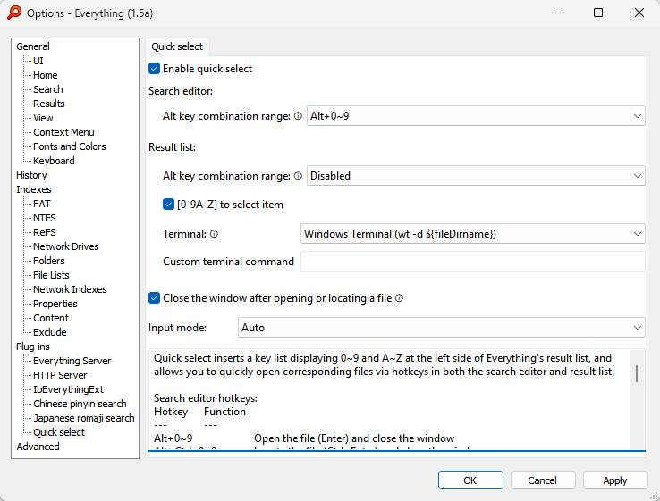

# IbEverythingExt
🌐Languages: [English](README.en.md), [简体中文](README.md)

[Everything](https://www.voidtools.com/) wildcard, Japanese romaji search, Chinese pinyin search, quick select extension. 


## Table of contents
- [Installation](#installation)
- [Search enhancement](#search-enhancement)
  - [Wildcard search](#wildcard-search)
  - [Japanese romaji search](#japanese-romaji-search)
  - [Chinese pinyin search](#chinese-pinyin-search)
  - [Third-party program support](#third-party-program-support)
- [Quick select](#quick-select)
  - [Hotkeys](#hotkeys)
  - [Key list](#key-list)
- [Others](#others)
  - [Quick launcher](#quick-launcher)
  - [Disk usage analysis](#disk-usage-analysis)
  - [Checking update](#checking-update)
- [→Development](docs/development.md)
- [Credits](#credits)
- [See also](#see-also)

## Installation
[Portable packages](https://github.com/Chaoses-Ib/IbEverythingExt/releases)：
- Everything v1.5 portable package
  - Besides IbEverythingExt, HTTP Server, ETP/FTP Server, Everything Server plugins are also included.
  - When using for the first time, please select IbEverythingExt in the Plug-ins page of Options and check "Enable plug-in".
  - [Named instance](https://github.com/Chaoses-Ib/IbEverythingExt/issues/5) is disabled by default to enable [third-party program support](#third-party-program-support). If needed, you can delete the `No_Alpha_Instance` file to restore.
- Everything v1.4 portable package
  - Doesn't include plugin configuration UI in Options. You need to manually edit `Plugins/IbEverythingExt/config.yaml` to configure the plugin.

Manual installation:
1. Install [Everything](https://www.voidtools.com/forum/viewtopic.php?f=12&t=9787#download) x64 installer or portable version (Other architectures and Lite version aren't supported)
   - For [v1.4](https://www.voidtools.com/en-us/downloads/), the highest supported version is [v1.4.1.1026](https://www.voidtools.com/forum/viewtopic.php?p=75414&sid=e7002e29f531b7c2fbecfa44c817eb0a#p75414). v1.4.1.1027 and later versions block DLL hijacking and cannot load this extension.
2. Download IbEverythingExt zip from [Releases](https://github.com/Chaoses-Ib/IbEverythingExt/releases)
3. Unzip files into Everything's program folder (`C:\Program Files\Everything`)
4. Restart Everything
5. For Everything v1.5 users: Select IbEverythingExt in the Plug-ins page of Options and check "Enable plug-in".

For Windows 7 users, you need to firstly install [VxKex](https://github.com/YuZhouRen86/VxKex-NEXT/releases) (`KexSetup_Release_*.exe`), and enable VxKex in the Properties of `Everything.exe` (or `Everything64.exe`). See [#87](https://github.com/Chaoses-Ib/IbEverythingExt/issues/87#issuecomment-3036778889) for details.

## Search enhancement
### Wildcard search
Wildcard | Semantics
--- | ---
`*` | Matches zero or more characters (except `\`).
`**` | Matches zero or more characters.
`?` | Matches one character (except `\`).
`/` | Matches characters to the start of a child (equivalent to `**\`).<br/>For example, `foo/alice` can match `foo\bar\alice`, but `foo/lice` can't.
`//` | Matches characters to a child (equivalent to `*\**`).<br/>For example, `foo//lice` can match `foo\bar\alice`.
`\\` | Ditto.

- Wildcard search supports Japanese romaji and Chinese pinyin search.
- Using a wildcard does not require the whole filename to be matched, unless it's at the start or the end.
- `/` and `//` wildcards can be controlled in Options. Enabled by default.

### Japanese romaji search
Search Japanese filenames via their romajis. Disabled by default on non-Japanese systems.

- Lowercase letters can match Japanese romaji or English letters, while uppercase letters match only English letters by default.
- Postmodifiers:
  - `;rm`: Lowercase letters match only Japanese romaji (e.g. `konosuba;rm`)
  - `;en`: Lowercase letters match only English letters (i.e. disable romaji match)
  - `;np`: Force using Everything's built-in match algorithm (nope/no-pinyin)


Everything v1.5 users can configure this in Options.

Everything v1.4 users need to manually edit the `Plugins/IbEverythingExt/config.yaml` file.

### Chinese pinyin search
允许用拼音在 Everything 中搜索文件。中文系统默认开启。

* 默认小写字母匹配拼音或字母，大写字母只匹配字母。
* 支持简拼、全拼、带声调全拼和双拼搜索，默认只开启简拼和全拼。  
  双拼搜索支持以下方案：
    * 微软双拼
    * 自然码双拼
    * 小鹤双拼
    * 拼音加加双拼
    * 智能 ABC 双拼
    * 华宇双拼（紫光双拼） 
  
  支持多音字和 Unicode 辅助平面汉字。
- 后置修饰符：
  - `;py`：小写字母只匹配拼音（例如 `pysseve;py`）
  - `;en`：禁用拼音匹配
  - `;np`：强制使用 Everything 内置匹配算法


#### Config
Everything v1.5 users can configure this in Options:


Everything v1.4 users need to manually edit the `Plugins/IbEverythingExt/config.yaml` file:

<details>

```yaml
# 拼音搜索
pinyin_search:
  # true：开启，false：关闭
  enable: true

  # 模式
  # Auto：自动
  # Pcre2：默认模式
  # Pcre：不支持忽略 Unicode 大小写，存在部分拼音匹配 bug (#56,#69,#77)
  # Edit：版本兼容性好，但只支持简拼搜索，性能较低，且存在许多 bug
  mode: Auto

  # 允许关键词末尾拼音部分匹配
  allow_partial_match: false

  initial_letter: true  # 简拼
  pinyin_ascii: true  # 全拼
  pinyin_ascii_digit: false  # 带声调全拼
  double_pinyin_abc: false  # 智能 ABC 双拼
  double_pinyin_jiajia: false  # 拼音加加双拼
  double_pinyin_microsoft: false  # 微软双拼
  double_pinyin_thunisoft: false  # 华宇双拼（紫光双拼）
  double_pinyin_xiaohe: false  # 小鹤双拼
  double_pinyin_zrm: false  # 自然码双拼
```
Edit 模式详见 [Edit 模式](docs/pinyin_search/edit_mode.md)。

</details>

### [Third-party program support](docs/third_party/README.md)
Wildcard search, Japanese romaji search and Chinese pinyin search also work with third-party programs that invokes Everything to search files. For example:
- [EverythingToolbar](https://github.com/stnkl/EverythingToolbar)  
  
- [Flow Launcher](https://github.com/Flow-Launcher/Flow.Launcher)'s [Explorer plugin](https://www.flowlauncher.com/docs/#/plugin-explorer?id=everything-setting-tab)  
  
- [PowerToys Run](https://learn.microsoft.com/windows/powertoys/run)'s [Everything plugin](https://github.com/lin-ycv/EverythingPowerToys)  
  
- [PowerToys Command Palette](https://learn.microsoft.com/windows/powertoys/command-palette/overview)'s [EverythingCommandPalette plugin](https://github.com/lin-ycv/EverythingCommandPalette)  
  
- [uTools](https://u.tools) local search  
  
- [Wox](https://github.com/Wox-launcher/Wox)'s Everything plugin
- [火柴（火萤酱）](https://www.huochaipro.com/)local search

If you are using Everything 1.5 Alpha (and not from the portable package), becuase Alpha version enables named instance by default, most programs can't invoke it. You need to[ configure Everything to disable named instance](https://github.com/Chaoses-Ib/IbEverythingExt/issues/5).

## Quick select
Quick select inserts a key list displaying 0\~9 and A\~Z at the left side of Everything's result list, and allows you to quickly open corresponding files via hotkeys in both the search editor and result list.

### Hotkeys
Search editor:
Hotkey | Function
--- | ---
`Alt+0~9` | Open the file (Enter) and close the window
`Alt+Ctrl+0~9` | Locate the file (Ctrl+Enter) and close the window
`Alt+Shift+0~9` | Show the context menu
`Alt+Shift+0~9, R` | Show file properties
`Tab` / `Enter` | Focus on the result list\*
`Esc` / `Ctrl+W` | Close the window\*

Result list:
Hotkey | Function
--- | ---
`[0-9A-Z]` | Select the item
`Enter` | Open the file\*
`Ctrl+Enter` | Locate the file\*
`Shift+F10` / `Menu` | Show the context menu\*
`Alt+Enter` | Show file properties\*
`Esc` / `Ctrl+W` | Close the window\*
`$ (Shift+4)` | Copy the filename and launch terminal from the parent folder of the file
`# (Shift+3)` | Copy the filename and launch terminal as Administrator from the parent folder of the file

Note:
* Whether to close the window after the operation can be controlled in Options.
* Hotkeys marked with \* are Everything's built-in hotkeys. They are listed here for completeness.

### Key list
Key list supports high DPI, but only supports zooming (hotkey `Ctrl+=` and `Ctrl+-`) on Everything v1.5a, not on Everything v1.4.

Everything v1.5a dark mode is supported:  


For Everything v1.5 Portable edition (or versions below v1.5.0.1397), when launched without being minimized, the first display of the search window will not show the key list. This does not affect subsequent displays.

### Config
Everything v1.5 users can configure this in Options:



Everything v1.4 users need to manually edit the `Plugins/IbEverythingExt/config.yaml` file:

<details>

```yaml
# 快速选择
quick_select:
  # true：开启，false：关闭
  enable: true

  # 搜索编辑框
  search_edit:
    # Alt 组合键范围
    # 0：禁用
    # 10：Alt+0~9
    # 36：Alt+[0-9A-Z]
      # 原本的 Alt+A~Z 访问菜单功能可以通过先单击 Alt 键再按 A~Z 实现
      # 默认的 Alt+1~4 调整窗口大小、Alt+P 预览和 Alt+D 聚焦搜索编辑框则无法使用，可以通过更改 Everything 选项来绑定到其它热键上（其中 Alt+D 也可使用相同功能的 Ctrl+F 和 F3 来代替）
    alt: 10

  # 结果列表
  result_list:
    # 同上
    alt: 0

    # [0-9A-Z] 选中项目
    select: true

    # 终端
    # Windows Terminal："wt -d ${fileDirname}"
    # Windows Console："conhost"（不支持以管理员身份启动）
    # 禁用：""
    terminal: "wt -d ${fileDirname}"

  # 打开或定位文件后关闭窗口（不对 Everything 默认热键生效）
  # 如果想要默认 Enter 热键也关闭窗口，可在 Everything 快捷键选项中将“打开选中对象，并退出 Everything”设置为 Enter
  close_everything: true

  # 输入模拟模式
  # Auto：v1.5a→WmKey，v1.4→SendInput
  # WmKey
  # SendInput
  input_mode: Auto
```
</details>

## Others
### Quick launcher
Compared to using traditional launchers, the primary advantage of employing file search tools like Everything is decentralization—there's no need to centralize all launch entries in one location. Instead, launch entries (shortcuts, note files, etc.) can be distributed across any folder. This not only reduces maintenance overhead but also promotes a more unified personal file management structure, making it ideal for scenarios with numerous launch entries.

To configure Everything as a quick launcher, the following settings are recommended:
1. Add the “Run Count” column: Right-click the header of the result list and select “Run Count”.
2. Set default sort to run count: `Options → General → Home → Sort → Run Count (Descending)`
3. Combine with search enhancement and quick select to launch files

To further enhance launch efficiency, you can create path/extension filters or bookmarks, register global hotkeys via shortcuts or tools like AutoHotkey to open new Everything windows with specified filters or bookmarks applied via command line.

### Disk usage analysis
* Duplicate files  
  `dupe: sizedupe:`  
  Where `dupe:` is for duplicate filenames and `sizedupe:` is for duplicate file sizes.

  
* Files larger than 100MB  
  `size:>100mb`
* Empty folders  
  `empty:`
* Visual Studio solution cache  
  `wfn:.vs`  

  

  Alternatively, you can use [VsCacheCleaner](https://github.com/SpriteOvO/VsCacheCleaner), a tool specifically designed to clean up `.vs` directories and built on top of Everything.

Note: To display folder sizes, you need to enable `Indexes → Index folder size` in Options.

对于文件管理器 [Directory Opus](https://github.com/Chaoses-Ib/DirectoryOpus) 的用户，亦可使用 [IbDOpusExt](https://github.com/Chaoses-Ib/IbDOpusExt) 从 Everything 获取文件夹大小并显示为列，便于分析硬盘占用：  


### Checking update
Everything v1.5 users can configure this in Options.

Everything v1.4 users need to manually edit the `Plugins/IbEverythingExt/config.yaml` file:

<details>

```yaml
# 更新
update:
  # 检查更新
  check: true

  # 包括预览版
  prerelease: false
```
</details>

## Development
See [development](docs/development.md).

## Credits
Date | Sponsor | Comment
--- | --- | ---
2025-07-22 | [@ligq](https://github.com/ligq) |
2026-01-25 | *曦 | 未知项目
2023-04-28 | Xudong.He@CN |
2024-07-09 | 田昊 \| JLL仲量联行 |
2025-08-20 | **宇 |

## See also
Groups:
- [Telegram 文件管理交流群](https://t.me/IbDirectoryOpusGroup)

Libraries:
- [ib-matcher: A multilingual, flexible and fast string, glob and regex matcher. Support 拼音匹配 and ローマ字検索.](https://github.com/Chaoses-Ib/ib-matcher)
- [IbEverythingLib: Rust/C++ bindings for voidtool's Everything](https://github.com/Chaoses-Ib/IbEverythingLib)
- [IbDllHijackLib: A C library for Windows DLL hijacking.](https://github.com/Chaoses-Ib/IbDllHijackLib)

Projects:
- [DirectoryOpus: 一款上手简单、系统集成度高、功能强大的 Windows 文件管理器](https://github.com/Chaoses-Ib/DirectoryOpus)
- [ObsidianShell: Associate Markdown files with Obsidian](https://github.com/Chaoses-Ib/ObsidianShell)
- [bash-pinyin-completion-rs: Simple completion script for pinyin, written in rust.](https://github.com/AOSC-Dev/bash-pinyin-completion-rs)
