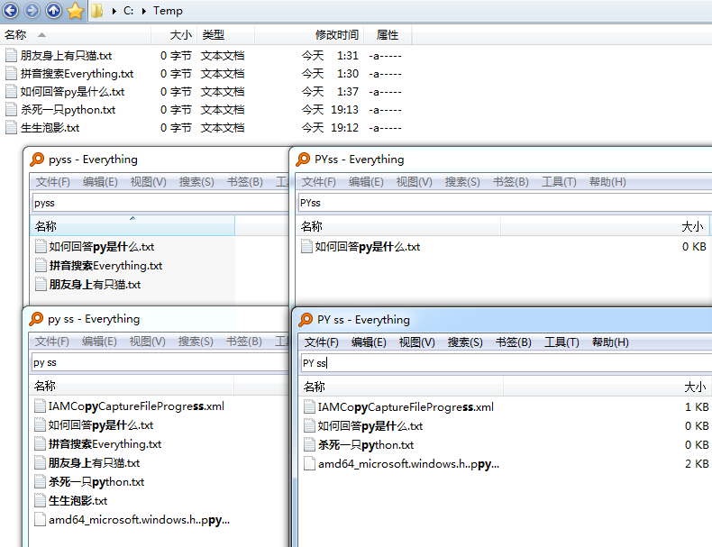

# IbEverythingExt
[Everything](https://www.voidtools.com/) 拼音搜索扩展。 

## 预览


## 安装
1. 从 [Releases](../../releases) 下载压缩包。
1. 解压压缩包，将 srvcli.dll 放入 Everything 安装目录（ `C:\Program Files\Everything` ）。
1. 运行 Everything。（如果不生效，请确认你使用的是 x64 版本的 Everything，并安装了 [VC++ 2019 运行时 x64](https://support.microsoft.com/topic/the-latest-supported-visual-c-downloads-2647da03-1eea-4433-9aff-95f26a218cc0)）

## 语法说明
* 小写字母匹配拼音或字母，大写字母只匹配字母。



## 构建
* Hijacker 和 Test
    1. 将以下库放入 `C:\L\C++\packages`（其它位置需要修改 .vcxproj 文件）：
        * [IbDllHijackLib](https://github.com/Chaoses-Ib/IbDllHijackLib/tree/master/DllHijackLib/IbDllHijackLib)
        * [IbEverythingLib](https://github.com/Chaoses-Ib/IbEverythingLib/tree/master/Cpp/IbEverythingLib)
        * [IbWinCppLib](https://github.com/Chaoses-Ib/IbWinCppLib/tree/master/WinCppLib/IbWinCppLib)
    1. [vcpkg](https://github.com/microsoft/vcpkg)
        ```
        set VCPKG_DEFAULT_TRIPLET=x64-windows-static-md
        vcpkg install detours
        ```
        （x86 版本的 VCPKG_DEFAULT_TRIPLET 应为  x86-windows-static-md）
    1. Test 还需要：
        ```
        vcpkg install boost-test
        ```
* data
    1. 从 [mozillazg/pinyin-data](https://github.com/mozillazg/pinyin-data) 获取 `pinyin.txt`，放入 data 目录。
    1. 运行 `generate_ord_pinyin.py`，得到 `output_ord_pinyin.txt`。