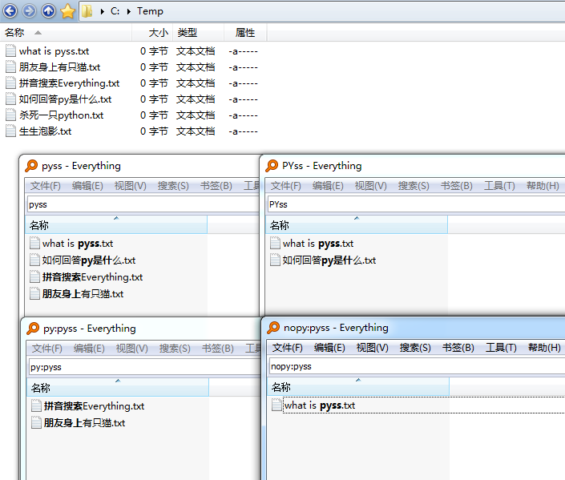
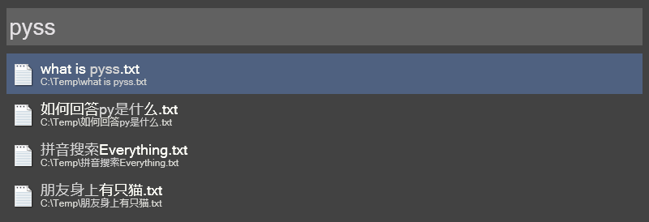

# IbEverythingExt
[Everything](https://www.voidtools.com/) 拼音搜索、快速选择扩展。 

## 预览


## 安装
1. 安装 Everything v1.4.1.1015 x64 [安装版](https://www.voidtools.com/Everything-1.4.1.1015.x64-Setup.exe)或[便携版](https://www.voidtools.com/Everything-1.4.1.1015.x64.zip)（不支持精简版）。
1. 从 [Releases](../../releases) 下载压缩包。
1. 解压压缩包，将 bin 目录下的文件放入 Everything 安装目录（ `C:\Program Files\Everything` ）。
1. 重启 Everything。（如果不生效，请确认你安装了 [VC++ 2019 x64 运行库](https://support.microsoft.com/topic/the-latest-supported-visual-c-downloads-2647da03-1eea-4433-9aff-95f26a218cc0)）

## 拼音搜索
* 支持包括辅助平面在内的 Unicode 汉字。
* 默认小写字母匹配拼音或字母，大写字母只匹配字母。

### PCRE 模式
* 支持简拼、全拼、带声调全拼、小鹤双拼搜索。（双拼搜索默认不开启）
* 支持 Everything 以下版本：
  * v1.4.1.1015 x64 [安装版](https://www.voidtools.com/Everything-1.4.1.1015.x64-Setup.exe)/[便携版](https://www.voidtools.com/Everything-1.4.1.1015.x64.zip)
  * v1.4.1.1009 x64 [安装版](https://www.voidtools.com/Everything-1.4.1.1009.x64-Setup.exe)/[便携版](https://www.voidtools.com/Everything-1.4.1.1009.x64.zip)
  * v1.5.0.1296a x64 [安装版](https://www.voidtools.com/Everything-1.5.0.1296a.x64-Setup.exe)/[便携版](https://www.voidtools.com/Everything-1.5.0.1296a.x64.zip)
* 后置修饰符：
  * `;py`：小写字母只匹配拼音
  * `;np`：禁用拼音搜索

### Edit 模式（停止维护）
* 只支持简拼搜索。
* 支持 Everything x64 安装版和便携版，不支持精简版。
* 修饰符：
    * `py:` 小写字母只匹配拼音
    * `nopy:` 禁用拼音搜索（对所有关键字生效）

  

## 快速选择
* `Alt+键`：打开（选中并按 Enter）
* `Alt+Ctrl+键`：定位（选中并按 Ctrl+Enter）
* `Alt+Shift+键`：打开右键菜单
* 原 Alt 键的功能可以通过先单击 Alt 键再按键实现。

## 配置
修改 `IbEverythingExt.yaml` 文件：
```yaml
# 拼音搜索
pinyin_search:
  enable: true
  mode: Auto  # Auto, Pcre, Edit
  initial: true  # 简拼
  pinyin_ascii: true  # 全拼
  pinyin_ascii_digit: true  # 带声调全拼
  double_pinyin_xiaohe: false  # 小鹤双拼
# 快速选择
quick_select:
  enable: true
```
（`true` 为开启，`false` 为关闭）

## 第三方程序支持
拼音搜索支持以下第三方程序调用：

* [stnkl/EverythingToolbar](https://github.com/stnkl/EverythingToolbar)  
  
* [Flow Launcher](https://github.com/Flow-Launcher/Flow.Launcher) 的 [Everything 插件](https://github.com/Flow-Launcher/Flow.Launcher.Plugin.Everything)  
  
* [火柴（火萤酱）](https://www.huochaipro.com/)本地搜索  
  
* [uTools](https://u.tools) 本地搜索  
  
* [Wox](https://github.com/Wox-launcher/Wox) 的 Everything 插件 
  

（如果使用的是 Everything Alpha 版，因为 Alpha 版默认启用了命名实例，大部分程序都不支持调用，需要[通过配置关闭命名实例](../../issues/5)。）

## 构建
* Hijacker 和 Test
    1. 将以下库放入 `C:\L\C++\packages`（其它位置需要修改 .vcxproj 文件）：
        * [IbDllHijackLib](https://github.com/Chaoses-Ib/IbDllHijackLib/tree/master/DllHijackLib/IbDllHijackLib)
        * [IbEverythingLib](https://github.com/Chaoses-Ib/IbEverythingLib/tree/master/Cpp/IbEverythingLib)
        * [IbPinyinLib](https://github.com/Chaoses-Ib/IbPinyinLib)
        * [IbWinCppLib](https://github.com/Chaoses-Ib/IbWinCppLib/tree/master/WinCppLib/IbWinCppLib)
    1. [vcpkg](https://github.com/microsoft/vcpkg)
        ```
        set VCPKG_DEFAULT_TRIPLET=x64-windows-static-md
        vcpkg install detours yaml-cpp
        ```
        （x86 版本的 VCPKG_DEFAULT_TRIPLET 应为  x86-windows-static-md）
    1. Test 还需要：
        ```
        vcpkg install boost-test pcre pcre2
        ```
* data
    1. 从 [Chaoses-Ib/pinyin-data](https://github.com/Chaoses-Ib/pinyin-data) 获取 `pinyin.txt`，放入 data 目录。
    1. 运行 `generate_ord_pinyin.py`，得到 `output_ord_pinyin.txt`。