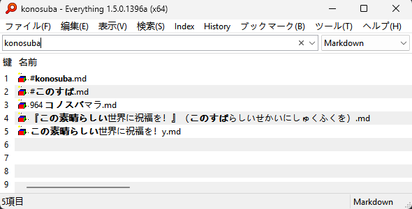

# IbEverythingExt
[Everything](https://www.voidtools.com/) 拼音搜索、ローマ字検索、通配符、快速选择扩展。 




## 目录
- [安装](#安装)
- [搜索增强](#搜索增强)
  - [拼音搜索](#拼音搜索)
  - [ローマ字検索](#ローマ字検索)
  - [通配符搜索](#通配符搜索)
  - [第三方程序支持](#第三方程序支持)
- [快速选择](#快速选择)
  - [热键](#热键)
  - [键列表](#键列表)
- [其它](#其它)
  - [快速启动器](#快速启动器)
  - [硬盘占用分析](#硬盘占用分析)
  - [检查更新](#检查更新)
- [→开发](docs/development.md)
- [致谢](#致谢)
- [相关链接](#相关链接)

## 安装
[便携整合包](https://github.com/Chaoses-Ib/IbEverythingExt/releases)：
- Everything v1.5 便携整合包
  - 除了 IbEverythingExt，还内置了 HTTP 服务器、ETP/FTP 服务器、Everything 服务器插件
  - 内置语言包，不过界面中仍有部分英文未汉化
  - 初次使用时请在选项的 Plug-ins（插件）页中选中 IbEverythingExt，勾选 Enable plug-in（开启插件）
  - 默认关闭[命名实例](https://github.com/Chaoses-Ib/IbEverythingExt/issues/5)，便于[第三方程序调用](#第三方程序支持)，如有需要可删除 `No_Alpha_Instance` 文件来还原
- Everything v1.4 便携整合包
  - 完整汉化
  - 不含插件配置界面，需要手动编辑 `Plugins/IbEverythingExt/config.yaml` 配置文件

手动安装：
1. 安装 [Everything](https://www.voidtools.com/zh-cn/downloads/) x64 安装版或便携版（不支持其它架构和精简版）  
   - v1.4 最高支持 [v1.4.1.1026](https://www.voidtools.com/forum/viewtopic.php?p=75414&sid=e7002e29f531b7c2fbecfa44c817eb0a#p75414)，v1.4.1.1027 及以上屏蔽了 DLL 劫持，无法加载扩展。
   - 如果你能接受英文界面，也可以选择安装 [Everything 1.5 预览版](https://www.voidtools.com/forum/viewtopic.php?f=12&t=9787#download)。
<!--
2. 安装 [VC++ 2022 x64 运行库](https://aka.ms/vs/17/release/vc_redist.x64.exe)  
   （[PowerToys](https://github.com/microsoft/PowerToys) 在安装时会同时安装 VC++ 2022 运行库，如果你安装了 PowerToys 就可以跳过这一步）
-->
2. 从 [Releases](https://github.com/Chaoses-Ib/IbEverythingExt/releases) 单独下载 IbEverythingExt 压缩包
3. 解压压缩包，将文件放入 Everything 安装目录（ `C:\Program Files\Everything` ）
4. 重启 Everything
5. Everything v1.5 用户：在选项的 Plug-ins（插件）页中选中 IbEverythingExt，勾选 Enable plug-in（开启插件）

Windows 7 用户需先安装 [VxKex](https://github.com/YuZhouRen86/VxKex-NEXT/releases)（`KexSetup_Release_*.exe`），并在 `Everything64.exe` / `Everything.exe` 文件属性中启用 VxKex。详见 [#87](https://github.com/Chaoses-Ib/IbEverythingExt/issues/87#issuecomment-3036778889)。

## 搜索增强
### 拼音搜索
允许用拼音在 Everything 中搜索文件。中文系统默认开启。

* 默认小写字母匹配拼音或字母，大写字母只匹配字母。
* 支持简拼、全拼、带声调全拼和双拼搜索，默认只开启简拼和全拼。  
  双拼搜索支持以下方案：
    * 微软双拼
    * 自然码双拼
    * 小鹤双拼
    * 拼音加加双拼
    * 智能 ABC 双拼
    * 华宇双拼（紫光双拼） 
  
  支持多音字和 Unicode 辅助平面汉字。
- 后置修饰符：
  - `;py`：小写字母只匹配拼音（例如 `pysseve;py`）
  - `;en`：禁用拼音匹配
  - `;np`：强制使用 Everything 内置匹配算法


#### 配置
Everything v1.5 用户可在选项中调整配置：


Everything v1.4 用户需要手动编辑 `Plugins/IbEverythingExt/config.yaml` 文件：

<details>

```yaml
# 拼音搜索
pinyin_search:
  # true：开启，false：关闭
  enable: true

  # 模式
  # Auto：自动
  # Pcre2：默认模式
  # Pcre：不支持忽略 Unicode 大小写，存在部分拼音匹配 bug (#56,#69,#77)
  # Edit：版本兼容性好，但只支持简拼搜索，性能较低，且存在许多 bug
  mode: Auto

  # 允许关键词末尾拼音部分匹配
  allow_partial_match: false

  initial_letter: true  # 简拼
  pinyin_ascii: true  # 全拼
  pinyin_ascii_digit: false  # 带声调全拼
  double_pinyin_abc: false  # 智能 ABC 双拼
  double_pinyin_jiajia: false  # 拼音加加双拼
  double_pinyin_microsoft: false  # 微软双拼
  double_pinyin_thunisoft: false  # 华宇双拼（紫光双拼）
  double_pinyin_xiaohe: false  # 小鹤双拼
  double_pinyin_zrm: false  # 自然码双拼
```
Edit 模式详见 [Edit 模式](docs/pinyin_search/edit_mode.md)。

</details>

### ローマ字検索
日语罗马字搜索。非日语系统默认关闭。

- 默认小写字母匹配罗马字或字母，大写字母只匹配字母。
- 后置修饰符：
  - `;rm`：小写字母只匹配罗马字（例如 `konosuba;rm`）
  - `;en`：禁用罗马字匹配
  - `;np`：强制使用 Everything 内置匹配算法


Everything v1.5 用户可在选项中调整配置。

Everything v1.4 用户需要手动编辑 `Plugins/IbEverythingExt/config.yaml` 文件。

### 通配符搜索
通配符 | 语义
--- | ---
`*` | 匹配零或多个字符（除了 `\`）
`**` | 匹配零或多个字符
`?` | 匹配一个字符（除了 `\`）
`/` | 匹配多个字符到子路径的文件名开头（等价于 `**\`）。<br/>例如，`xx/7y` 可以匹配到 `学习资料\时间\7月合集`，但 `xx/hj` 不可以。
`//` | 匹配多个字符到子路径（等价于 `*\**`）。<br/>例如，`xx//hj` 可以匹配到 `学习资料\时间\7月合集`。
`\\` | 同上

- 通配符支持拼音搜索和罗马字搜索。
- 使用通配符时不要求匹配完整文件名，除非通配符位于开头或末尾。
- `/` 和 `//` 通配符可在选项中开关，默认开启。

### [第三方程序支持](docs/third_party/README.md)
拼音搜索、罗马字搜索、通配符搜索对调用 Everything 进行搜索的第三方程序同样生效，例如：
- [EverythingToolbar](https://github.com/stnkl/EverythingToolbar)  
  
- [Flow Launcher](https://github.com/Flow-Launcher/Flow.Launcher) 的 [Explorer 插件](https://www.flowlauncher.com/docs/#/plugin-explorer?id=everything-setting-tab)  
  
- [PowerToys Run](https://learn.microsoft.com/windows/powertoys/run) 的 [Everything 插件](https://github.com/lin-ycv/EverythingPowerToys)  
  
- [PowerToys 命令面板（Command Palette）](https://learn.microsoft.com/windows/powertoys/command-palette/overview) 的 [EverythingCommandPalette 插件](https://github.com/lin-ycv/EverythingCommandPalette)  
  
- [uTools](https://u.tools) 本地搜索  
  
- [Wox](https://github.com/Wox-launcher/Wox) 的 Everything 插件
- [火柴（火萤酱）](https://www.huochaipro.com/)本地搜索

如果使用的是（非整合包中的）Everything 1.5 预览版，因为预览版默认启用了命名实例，大部分程序都不支持调用，需要[通过配置关闭命名实例](https://github.com/Chaoses-Ib/IbEverythingExt/issues/5)。

## 快速选择
在 Everything 结果列表的左侧插入一个显示 0\~9、A\~Z 的键列表，并允许在搜索编辑框和结果列表中通过热键快速打开对应文件。

### 热键
搜索编辑框：
热键 | 功能
--- | ---
`Alt+0~9` | 打开文件（Enter）并关闭窗口
`Alt+Ctrl+0~9` | 定位文件（Ctrl+Enter）并关闭窗口
`Alt+Shift+0~9` | 打开右键菜单
`Alt+Shift+0~9, R` | 查看文件属性
`Tab` / `Enter` | 转移焦点到结果列表\*
`Esc` / `Ctrl+W` | 关闭窗口\*

结果列表：
热键 | 功能
--- | ---
`[0-9A-Z]` | 选中项目
`Enter` | 打开文件\*
`Ctrl+Enter` | 定位文件\*
`Shift+F10` / `Menu` | 打开右键菜单\*
`Alt+Enter` | 查看文件属性\*
`Esc` / `Ctrl+W` | 关闭窗口\*
`$ (Shift+4)` | 复制文件名，在文件所属目录下启动终端
`# (Shift+3)` | 复制文件名，以管理员身份在文件所属目录下启动终端

注：
* 操作之后是否关闭窗口可以通过配置进行控制。
* 标 \* 的热键为 Everything 默认热键，不是扩展增加的，在这里列出是为了完整性。

### 键列表
键列表支持高 DPI，但只在 Everything v1.5a 上支持缩放（热键为 `Ctrl+=` 和 `Ctrl+-`），在 Everything v1.4 上则不支持。

支持 Everything v1.5a 深色模式：  


### 配置
Everything v1.5 用户可在选项中调整配置：


Everything v1.4 用户需要手动编辑 `Plugins/IbEverythingExt/config.yaml` 文件：

<details>

```yaml
# 快速选择
quick_select:
  # true：开启，false：关闭
  enable: true

  # 搜索编辑框
  search_edit:
    # Alt 组合键范围
    # 0：禁用
    # 10：Alt+0~9
    # 36：Alt+[0-9A-Z]
      # 原本的 Alt+A~Z 访问菜单功能可以通过先单击 Alt 键再按 A~Z 实现
      # 默认的 Alt+1~4 调整窗口大小、Alt+P 预览和 Alt+D 聚焦搜索编辑框则无法使用，可以通过更改 Everything 选项来绑定到其它热键上（其中 Alt+D 也可使用相同功能的 Ctrl+F 和 F3 来代替）
    alt: 10

  # 结果列表
  result_list:
    # 同上
    alt: 0

    # [0-9A-Z] 选中项目
    select: true

    # 终端
    # Windows Terminal："wt -d ${fileDirname}"
    # Windows Console："conhost"（不支持以管理员身份启动）
    # 禁用：""
    terminal: "wt -d ${fileDirname}"

  # 打开或定位文件后关闭窗口（不对 Everything 默认热键生效）
  # 如果想要默认 Enter 热键也关闭窗口，可在 Everything 快捷键选项中将“打开选中对象，并退出 Everything”设置为 Enter
  close_everything: true

  # 输入模拟模式
  # Auto：v1.5a→WmKey，v1.4→SendInput
  # WmKey
  # SendInput
  input_mode: Auto
```
</details>

## 其它
### 快速启动器
相较于使用传统的快速启动器，使用 Everything 这类文件搜索器的主要好处是可以实现去中心化——不必将所有的启动入口集中到一个地方，而是可以在任意个文件夹下分散放置启动入口（快捷方式、笔记文件等），不仅降低了维护成本，还能让个人的文件管理结构更加统一，更适合有大量启动入口的情况。

若要将 Everything 用作快速启动器，推荐进行以下配置：
1. 添加运行次数列：右键结果列表表头，选中运行次数
2. 设置默认按运行次数排序：`选项 → 常规 → 首页 → 排序 → 运行次数（降序）`
3. 配合扩展的拼音搜索和快速选择启动文件

若要更进一步地提高启动效率，可以建立限定路径和扩展名的过滤器或书签，并通过快捷方式或 AutoHotkey 等工具注册全局热键，通过命令行新建 Everything 窗口并应用指定的过滤器或书签。

### 硬盘占用分析
* 重复文件  
  `dupe: sizedupe:`  
  其中 `dupe:` 用于限定文件名重复，`sizedupe:` 用于限定文件大小重复。

  
* 大于 100MB 的文件  
  `size:>100mb`
* 空文件夹  
  `empty:`
* Visual Studio 解决方案缓存  
  `wfn:.vs`  

  

  或者也可使用基于 Everything 实现的专用于清理 `.vs` 的工具 [VsCacheCleaner](https://github.com/SpriteOvO/VsCacheCleaner)。

注意，显示文件夹大小需要在 Everything 选项中开启 `索引 → 索引文件夹大小`。

对于文件管理器 [Directory Opus](https://github.com/Chaoses-Ib/DirectoryOpus) 的用户，亦可使用 [IbDOpusExt](https://github.com/Chaoses-Ib/IbDOpusExt) 从 Everything 获取文件夹大小并显示为列，便于分析硬盘占用：  


### 检查更新
Everything v1.5 用户可在选项中调整配置。

Everything v1.4 用户需要手动编辑 `Plugins/IbEverythingExt/config.yaml` 文件：

<details>

```yaml
# 更新
update:
  # 检查更新
  check: true

  # 包括预览版
  prerelease: false
```
</details>

## 开发
见 [开发](docs/development.md)。

## 致谢
日期 | 捐赠者 | 备注
--- | --- | ---
2025-07-22 | [@ligq](https://github.com/ligq) |
2023-04-28 | Xudong.He@CN |
2024-07-09 | 田昊 \| JLL仲量联行 |
2025-08-20 | **宇 |

## 相关链接
群组：
- [Telegram 文件管理交流群](https://t.me/IbDirectoryOpusGroup)

库：
- [ib-matcher: A multilingual, flexible and fast string and regex matcher, supports 拼音匹配 and ローマ字検索](https://github.com/Chaoses-Ib/ib-matcher)
- [IbEverythingLib: Rust/C++ bindings for voidtool's Everything](https://github.com/Chaoses-Ib/IbEverythingLib)
- [IbDllHijackLib: A C library for Windows DLL hijacking.](https://github.com/Chaoses-Ib/IbDllHijackLib)

项目：
- [DirectoryOpus: 一款上手简单、系统集成度高、功能强大的 Windows 文件管理器](https://github.com/Chaoses-Ib/DirectoryOpus)
- [ObsidianShell: 关联 Markdown 文件到 Obsidian](https://github.com/Chaoses-Ib/ObsidianShell)
- [bash-pinyin-completion-rs: Simple completion script for pinyin, written in rust.](https://github.com/AOSC-Dev/bash-pinyin-completion-rs)
