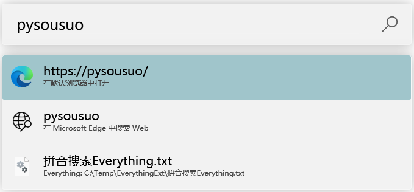

# 第三方程序
## [EverythingToolbar](https://github.com/stnkl/EverythingToolbar)
> Everything integration for the Windows taskbar.

## [Flow Launcher](https://github.com/Flow-Launcher/Flow.Launcher)
> Quick file search & app launcher for Windows with community-made plugins.

[Everything 插件](https://github.com/Flow-Launcher/Flow.Launcher.Plugin.Everything)：  

## [PowerToys Run](https://learn.microsoft.com/windows/powertoys/run)
[Everything 插件](https://github.com/lin-ycv/EverythingPowerToys)：  

## [uTools](https://u.tools)
> 新一代效率工具平台  
> 自由组合丰富插件，打造随手可取的终极神器

本地搜索：  

## [Wox](https://github.com/Wox-launcher/Wox)
> Launcher for Windows, an alternative to Alfred and Launchy.

Everything 插件：  

## [火柴（火萤酱）](https://www.huochaipro.com/)
> “电脑必备，效率神器。快速查找文件、打开应用程序、局域网秒传文件、局域网聊天...”

本地搜索：  

## [Total Commander](https://www.ghisler.com/)
> Total Commander is a Shareware file manager for Windows® 95/98/ME/NT/2000/XP/Vista/7/8/8.1/10/11, and Windows® 3.1.

由于 TC 调用 Everything 搜索时是先获取所有文件，再通过自己的匹配机制匹配文件，扩展的拼音搜索无法对 TC 生效。